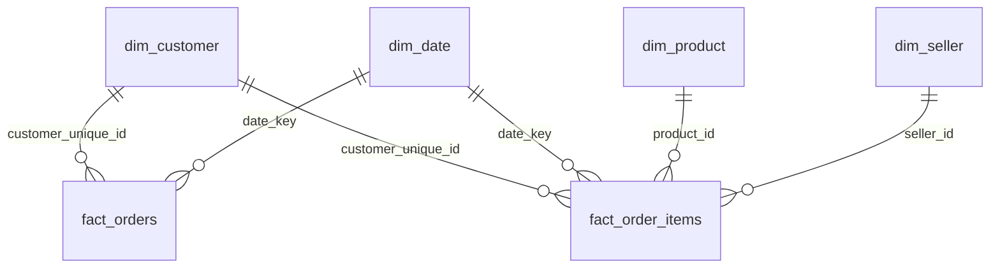

# Olist E-Commerce Business Intelligence Dashboard

End-to-end BI project on ~100K real orders from Olist, a Brazilian marketplace (2016-2018).
The goal is to find out why customer satisfaction is uneven and why so few customers buy again,
and to turn the answer into concrete actions for Sales, Marketing, Operations and Customer Service.

**Stack:** Python (pandas, NumPy, matplotlib) · SQL (DuckDB, PostgreSQL-compatible) · Power BI (DAX)

> Work in progress. Status by stage is tracked below.

## Project status

| Stage | Deliverable | Status |
|---|---|---|
| 1 | Data loading + data-quality validation ([report](reports/data_quality_report.md)) | Done |
| 2 | Cleaning pipeline, star schema export ([model](reports/data_model.md), [cleaning log](reports/cleaning_log.md)) and 9 business SQL queries ([results](reports/sql_results.md)) | Done |
| 3 | Power BI model (relationships) + DAX measures | Pending |
| 4 | 4-page Power BI dashboard | Pending |
| 5 | Executive summary (5 findings + recommendations) | Pending |

## Repository structure

```
olist-bi-dashboard/
├── data/
│   ├── raw/          # original Kaggle CSVs (not versioned)
│   ├── interim/      # typed Parquet cache (not versioned)
│   └── processed/    # clean tables for Power BI (not versioned)
├── src/
│   ├── config.py     # paths, schemas and every data-quality rule
│   ├── load.py       # typed loading of the 9 tables
│   ├── validate.py   # data-quality checks (never modifies data)
│   ├── report.py     # data-quality report (Markdown/CSV + figures)
│   ├── clean.py      # treatments from the quality report, with a cleaning log
│   ├── model.py      # star schema (2 facts, 4 dims) + integrity checks
│   ├── dictionary.py # business definition of every column
│   ├── export.py     # CSVs for Power BI + model documentation
│   ├── run_sql.py    # runs sql/business_queries.sql on DuckDB
│   └── main.py       # pipeline entry point
├── tests/            # pytest suite with a synthetic dataset of planted defects
├── sql/              # business queries
├── powerbi/          # .pbix file
├── reports/          # data-quality report, executive summary, figures
└── images/           # dashboard screenshots
```

## How to reproduce

```bash
git clone https://github.com/<your-user>/olist-bi-dashboard.git
cd olist-bi-dashboard
python -m venv .venv && .venv\Scripts\activate      # Windows
pip install -r requirements.txt
```

1. Download the dataset from [Kaggle](https://www.kaggle.com/datasets/olistbr/brazilian-ecommerce)
   and unzip the 9 CSV files into `data/raw/`.
2. Run the pipeline and the tests:

```bash
python -m src.main        # validate -> clean -> model -> data/processed/*.csv
python -m src.run_sql     # business queries -> reports/sql_results.md
python -m pytest -q       # 20 unit tests
```

## Data-quality approach

The validator runs 79 checks across seven dimensions: completeness, uniqueness, validity,
consistency, referential integrity, accuracy (outliers) and timeliness.
Each finding has a severity and a recommended treatment, and that treatment is what the cleaning stage implements.
Main findings:

- `customer_id` is generated per order. Repeat-customer analysis must use `customer_unique_id`
  (2,997 people bought more than once).
- Payments (2,961 orders) and reviews (547 orders) have more than one row per order. They are
  aggregated to order level before modelling to avoid double counting in Power BI.
- 6 purchase months are incomplete (Sep-Dec 2016, Sep-Oct 2018). Trend analysis uses
  **Jan 2017 - Aug 2018**.
- 1,359 orders appear to be handed to the carrier before payment approval. These rows are excluded from duration metrics.

## Data model

Two fact tables at different grains share conformed dimensions. All relationships are
one-to-many and single-direction. Full dictionary: [reports/data_model.md](reports/data_model.md).



The pipeline stops if a primary key is duplicated, a foreign key is orphaned, or revenue and
payments do not reconcile with the raw tables (16 integrity checks).

## Data source and license

[Brazilian E-Commerce Public Dataset by Olist](https://www.kaggle.com/datasets/olistbr/brazilian-ecommerce),
licensed under CC BY-NC-SA 4.0. The raw data is not redistributed in this repository.
