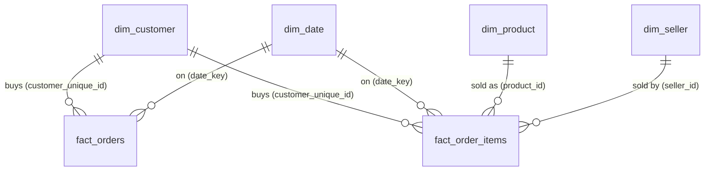

# Data Model - Star Schema

*Generated by `python -m src.main` on 2026-09-30 19:05.*

## Diagram

Two fact tables at different grains share the conformed dimensions `dim_customer` and `dim_date`. All relationships are **one-to-many, single direction**.

## Tables

| table            | grain                                 | primary key             |    rows |   columns | purpose                                                                    |
|:-----------------|:--------------------------------------|:------------------------|--------:|----------:|:---------------------------------------------------------------------------|
| fact_orders      | 1 row per order                       | order_id                |  99,441 |        42 | Order-level KPIs: delivery, on-time %, reviews, payments, repeat purchases |
| fact_order_items | 1 row per item within an order        | order_id, order_item_id | 112,650 |        20 | Revenue by product, category and seller                                    |
| dim_customer     | 1 row per person (customer_unique_id) | customer_unique_id      |  96,096 |        13 | Customer location and lifetime attributes                                  |
| dim_product      | 1 row per product                     | product_id              |  32,951 |        11 | Category and physical attributes                                           |
| dim_seller       | 1 row per seller                      | seller_id               |   3,095 |         8 | Seller location                                                            |
| dim_date         | 1 row per calendar day (full years)   | date_key                |   1,096 |        16 | Calendar for time intelligence                                             |

## Integrity checks

The pipeline stops if any of these fails.

| check                                                                               | result   | detail                         |
|:------------------------------------------------------------------------------------|:---------|:-------------------------------|
| fact_orders: PK ['order_id'] unique & not null                                      | PASS     | 99,441 rows                    |
| fact_order_items: PK ['order_id', 'order_item_id'] unique & not null                | PASS     | 112,650 rows                   |
| dim_customer: PK ['customer_unique_id'] unique & not null                           | PASS     | 96,096 rows                    |
| dim_product: PK ['product_id'] unique & not null                                    | PASS     | 32,951 rows                    |
| dim_seller: PK ['seller_id'] unique & not null                                      | PASS     | 3,095 rows                     |
| dim_date: PK ['date_key'] unique & not null                                         | PASS     | 1,096 rows                     |
| fact_orders.customer_unique_id -> dim_customer.customer_unique_id (no orphans)      | PASS     | 0 orphans                      |
| fact_orders.date_key -> dim_date.date_key (no orphans)                              | PASS     | 0 orphans                      |
| fact_order_items.customer_unique_id -> dim_customer.customer_unique_id (no orphans) | PASS     | 0 orphans                      |
| fact_order_items.date_key -> dim_date.date_key (no orphans)                         | PASS     | 0 orphans                      |
| fact_order_items.product_id -> dim_product.product_id (no orphans)                  | PASS     | 0 orphans                      |
| fact_order_items.seller_id -> dim_seller.seller_id (no orphans)                     | PASS     | 0 orphans                      |
| fact_orders keeps every raw order                                                   | PASS     | 99,441                         |
| fact_order_items keeps every raw item                                               | PASS     | 112,650                        |
| Revenue reconciles across facts (sum price)                                         | PASS     | 13,591,643.70 vs 13,591,643.70 |
| Payments reconcile with raw table                                                   | PASS     | 16,008,872.12 vs 16,008,872.12 |

## Modelling notes

- **Revenue = sum of item `price`** for sales (status not canceled/unavailable). Freight and installment interest are reported separately.
- `fact_order_items` repeats order context (`review_score`, `is_late`, `delivery_days`) on each item so sellers can be analysed without bidirectional filters. In DAX, aggregate these columns **per order** (e.g. `AVERAGEX(SUMMARIZE(fact_order_items, fact_order_items[order_id], fact_order_items[review_score]), [review_score])`).
- For seller ratings, orders with several sellers (`is_multi_seller`) share one review; exclude them when a strict attribution is required.
- Use `dim_date[is_complete_month]` to restrict trends and MoM % to complete months.

## Data dictionary

### fact_orders

*Grain: 1 row per order.*

| column                        | type           |   % null | description                                                              |
|:------------------------------|:---------------|---------:|:-------------------------------------------------------------------------|
| order_id                      | string         |     0    | Order identifier                                                         |
| customer_unique_id            | string         |     0    | Person identifier (stable across orders)                                 |
| date_key                      | int64          |     0    | Purchase date as YYYYMMDD integer -> dim_date                            |
| purchase_date                 | datetime64[us] |     0    | Purchase date (no time)                                                  |
| order_purchase_timestamp      | datetime64[us] |     0    | Purchase date and time                                                   |
| order_status                  | str            |     0    | Order status from source system                                          |
| is_sale                       | bool           |     0    | TRUE unless status is canceled or unavailable (basis of revenue KPIs)    |
| has_items                     | bool           |     0    | Order has at least one item                                              |
| is_delivered                  | bool           |     0    | Status 'delivered' AND a valid delivery date (basis of logistics KPIs)   |
| is_late                       | boolean        |     2.99 | Delivered after the promised date (calendar days). NULL if not delivered |
| is_multi_seller               | bool           |     0    | Order contains items from more than one seller                           |
| is_repeat_purchase            | boolean        |     1.24 | Customer's 2nd or later sale                                             |
| customer_order_seq            | Int64          |     1.24 | Purchase number for this customer (1 = first sale). NULL for non-sales   |
| items_count                   | int64          |     0    | Number of items in the order                                             |
| products_count                | int64          |     0    | Distinct products in the order                                           |
| sellers_count                 | int64          |     0    | Distinct sellers in the order                                            |
| items_price                   | float64        |     0    | Sum of item prices (BRL). REVENUE definition                             |
| freight_total                 | float64        |     0    | Sum of freight (BRL)                                                     |
| order_value                   | float64        |     0    | items_price + freight_total (BRL)                                        |
| payment_total                 | float64        |     0    | Total paid by the customer (BRL, includes installment interest)          |
| main_payment_type             | str            |     0    | Payment method carrying the largest amount                               |
| payment_methods               | Int64          |     0    | Number of distinct payment methods used                                  |
| max_installments              | Int64          |     0    | Maximum number of installments                                           |
| is_installment                | boolean        |     0    | Paid in more than one installment                                        |
| used_voucher                  | boolean        |     0    | At least one voucher was used                                            |
| order_approved_at             | datetime64[us] |     0.16 | Payment approval timestamp                                               |
| order_delivered_carrier_date  | datetime64[us] |     1.79 | Handed to carrier                                                        |
| order_delivered_customer_date | datetime64[us] |     2.98 | Delivered to customer                                                    |
| order_estimated_delivery_date | datetime64[us] |     0    | Delivery date promised at purchase                                       |
| approval_hours                | float64        |     0.16 | Hours from purchase to approval                                          |
| carrier_lead_days             | float64        |     3.17 | Days from approval to carrier pickup (NULL if dates inconsistent)        |
| last_mile_days                | float64        |     3.01 | Days from carrier pickup to delivery (NULL if dates inconsistent)        |
| delivery_days                 | float64        |     2.99 | Days from purchase to delivery (delivered orders only)                   |
| promised_days                 | float64        |     0    | Days from purchase to promised date                                      |
| delay_days                    | float64        |     2.99 | Delivery date minus promised date in days (negative = early)             |
| flag_carrier_before_approval  | bool           |     0    | Data-quality flag: carrier date earlier than approval                    |
| flag_delivered_before_carrier | bool           |     0    | Data-quality flag: delivery earlier than carrier pickup                  |
| has_review                    | bool           |     0    | Order has a review                                                       |
| review_score                  | Int8           |     0.77 | Review score 1-5 (latest review of the order)                            |
| review_count                  | int64          |     0    | Number of reviews received by the order                                  |
| has_comment                   | boolean        |     0.77 | Review includes a title or message                                       |
| review_response_hours         | float64        |     0.77 | Hours Olist took to answer the review survey                             |

### fact_order_items

*Grain: 1 row per item within an order.*

| column              | type           |   % null | description                                                              |
|:--------------------|:---------------|---------:|:-------------------------------------------------------------------------|
| order_id            | string         |     0    | Order identifier                                                         |
| order_item_id       | Int16          |     0    | Sequential item number within the order (1..n)                           |
| product_id          | string         |     0    | Product identifier                                                       |
| seller_id           | string         |     0    | Seller identifier                                                        |
| customer_unique_id  | string         |     0    | Person identifier (stable across orders)                                 |
| date_key            | int64          |     0    | Purchase date as YYYYMMDD integer -> dim_date                            |
| purchase_date       | datetime64[us] |     0    | Purchase date (no time)                                                  |
| shipping_limit_date | datetime64[us] |     0.01 | Seller deadline to hand the item to the carrier                          |
| price               | float64        |     0    | Item price (BRL)                                                         |
| freight_value       | float64        |     0    | Item freight (BRL)                                                       |
| item_total          | float64        |     0    | price + freight_value                                                    |
| freight_share       | float64        |     0    | freight_value / item_total                                               |
| freight_gt_price    | bool           |     0    | Freight more expensive than the item                                     |
| order_status        | str            |     0    | Order status from source system                                          |
| is_sale             | bool           |     0    | TRUE unless status is canceled or unavailable (basis of revenue KPIs)    |
| is_delivered        | bool           |     0    | Status 'delivered' AND a valid delivery date (basis of logistics KPIs)   |
| is_late             | boolean        |     2.18 | Delivered after the promised date (calendar days). NULL if not delivered |
| delivery_days       | float64        |     2.18 | Days from purchase to delivery (delivered orders only)                   |
| review_score        | Int8           |     0.84 | Review score 1-5 (latest review of the order)                            |
| is_multi_seller     | bool           |     0    | Order contains items from more than one seller                           |

### dim_customer

*Grain: 1 row per person (customer_unique_id).*

| column              | type           |   % null | description                                         |
|:--------------------|:---------------|---------:|:----------------------------------------------------|
| customer_unique_id  | string         |     0    | Person identifier (stable across orders)            |
| zip_code_prefix     | string         |     0    | First 5 digits of the zip code                      |
| city                | str            |     0    | City (lower-case, no accents)                       |
| state               | str            |     0    | State code (UF)                                     |
| region              | str            |     0    | IBGE macro-region                                   |
| lat                 | float64        |     0.06 | Latitude (median of zip prefix, or city centroid)   |
| lng                 | float64        |     0.06 | Longitude (median of zip prefix, or city centroid)  |
| geo_source          | str            |     0    | Coordinate precision: zip, city_centroid or missing |
| first_purchase_date | datetime64[us] |     1.15 | First sale date                                     |
| last_purchase_date  | datetime64[us] |     1.15 | Most recent sale date                               |
| lifetime_orders     | int64          |     0    | Number of sales                                     |
| lifetime_revenue    | float64        |     0    | Sum of item prices across sales (BRL)               |
| is_repeat_customer  | bool           |     0    | Customer with 2 or more sales                       |

### dim_product

*Grain: 1 row per product.*

| column                     | type    |   % null | description                                                  |
|:---------------------------|:--------|---------:|:-------------------------------------------------------------|
| product_id                 | string  |     0    | Product identifier                                           |
| category                   | str     |     0    | Product category (English, title case; 'Unknown' if missing) |
| category_pt                | string  |     0    | Original category name (Portuguese)                          |
| product_weight_g           | Int32   |     0.02 | Weight in grams                                              |
| product_length_cm          | Int32   |     0.01 | Length in cm                                                 |
| product_height_cm          | Int32   |     0.01 | Height in cm                                                 |
| product_width_cm           | Int32   |     0.01 | Width in cm                                                  |
| product_volume_cm3         | Float64 |     0.01 | length x height x width                                      |
| product_photos_qty         | Int16   |     1.85 | Number of photos in the listing                              |
| product_name_length        | Int32   |     1.85 | Characters in the product name                               |
| product_description_length | Int32   |     1.85 | Characters in the description                                |

### dim_seller

*Grain: 1 row per seller.*

| column          | type    |   % null | description                                         |
|:----------------|:--------|---------:|:----------------------------------------------------|
| seller_id       | string  |        0 | Seller identifier                                   |
| zip_code_prefix | string  |        0 | First 5 digits of the zip code                      |
| city            | str     |        0 | City (lower-case, no accents)                       |
| state           | str     |        0 | State code (UF)                                     |
| region          | str     |        0 | IBGE macro-region                                   |
| lat             | float64 |        0 | Latitude (median of zip prefix, or city centroid)   |
| lng             | float64 |        0 | Longitude (median of zip prefix, or city centroid)  |
| geo_source      | str     |        0 | Coordinate precision: zip, city_centroid or missing |

### dim_date

*Grain: 1 row per calendar day (full years).*

| column            | type           |   % null | description                                                 |
|:------------------|:---------------|---------:|:------------------------------------------------------------|
| date              | datetime64[us] |        0 | Calendar date                                               |
| date_key          | int64          |        0 | Purchase date as YYYYMMDD integer -> dim_date               |
| year              | int32          |        0 | Year                                                        |
| quarter           | str            |        0 | Quarter (Q1-Q4)                                             |
| year_quarter      | str            |        0 | Year and quarter (2017-Q1)                                  |
| month_num         | int32          |        0 | Month number                                                |
| month_name        | str            |        0 | Month name                                                  |
| month_short       | str            |        0 | Month abbreviation                                          |
| year_month        | str            |        0 | Year and month (2017-01)                                    |
| year_month_num    | int32          |        0 | Year*100+month; sort key for year_month                     |
| month_start       | datetime64[us] |        0 | First day of the month                                      |
| iso_week          | int64          |        0 | ISO week number                                             |
| day_of_week_num   | int32          |        0 | Day of week (Monday = 1)                                    |
| day_name          | str            |        0 | Day name                                                    |
| is_weekend        | bool           |        0 | Saturday or Sunday                                          |
| is_complete_month | bool           |        0 | Month with enough orders to be used in trend / MoM analysis |
