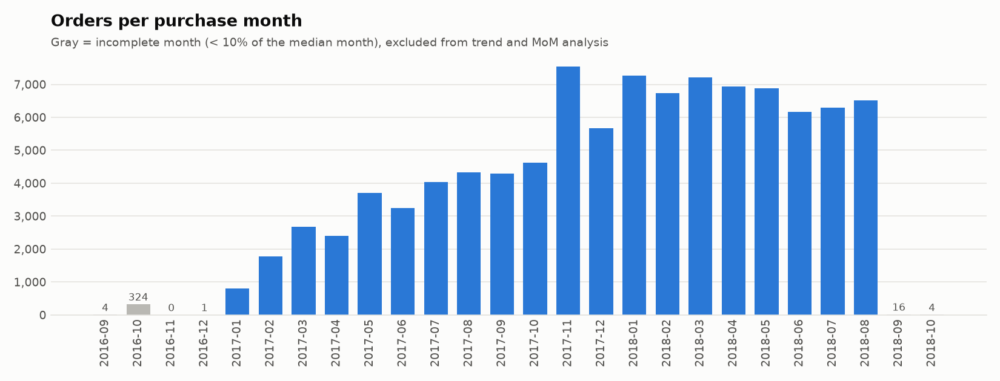
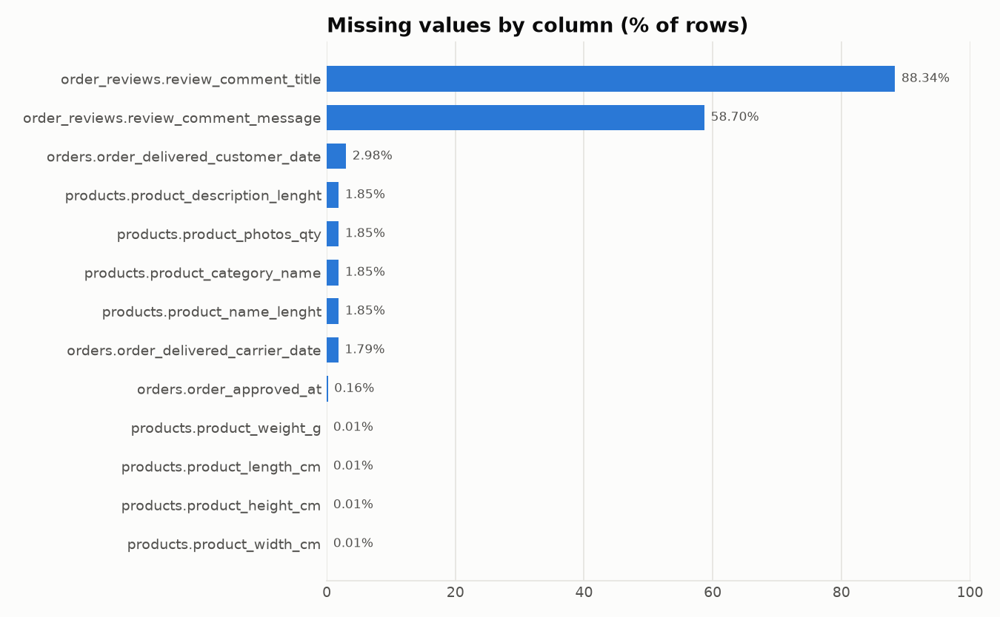

# Data Quality Report - Olist Brazilian E-Commerce

*Generated automatically by `python -m src.main` on 2026-09-30 18:51. Source: [Kaggle](https://www.kaggle.com/datasets/olistbr/brazilian-ecommerce).*

## 1. Summary

- **9 tables**, **1,550,922 rows** in total.
- **79 checks** run across 7 data-quality dimensions: **39 passed**, 0 critical, 24 warnings, 16 informational.
- Reliable analysis window: **2017-01 to 2018-08** (20 complete months).

**Severity scale.** `FAIL` breaks the data model or a KPI if left untreated. `WARN` biases a metric and needs a documented decision. `INFO` is a property of the data that the model must respect.

## 2. Table profile

| table                | file                                  |      rows |   columns |   memory_mb |   null_cells_pct | date_range               |
|:---------------------|:--------------------------------------|----------:|----------:|------------:|-----------------:|:-------------------------|
| orders               | olist_orders_dataset.csv              |    99,441 |         8 |       12.10 |             0.62 | 2016-09-04 to 2018-11-12 |
| order_items          | olist_order_items_dataset.csv         |   112,650 |         7 |       16.60 |             0.00 | 2016-09-19 to 2020-04-09 |
| order_payments       | olist_order_payments_dataset.csv      |   103,886 |         5 |        5.70 |             0.00 | -                        |
| order_reviews        | olist_order_reviews_dataset.csv       |    99,224 |         7 |       14.40 |            21.01 | 2016-10-02 to 2018-10-29 |
| customers            | olist_customers_dataset.csv           |    99,441 |         5 |       11.20 |             0.00 | -                        |
| products             | olist_products_dataset.csv            |    32,951 |         9 |        3.20 |             0.83 | -                        |
| sellers              | olist_sellers_dataset.csv             |     3,095 |         4 |        0.20 |             0.00 | -                        |
| geolocation          | olist_geolocation_dataset.csv         | 1,000,163 |         5 |       48.70 |             0.00 | -                        |
| category_translation | product_category_name_translation.csv |        71 |         2 |        0.00 |             0.00 | -                        |

## 3. Findings (checks that did not pass)

| status   | dimension    | table          | check                                                                                                      |   n_affected |   n_total |   % affected | detail                                                                                                                          |
|:---------|:-------------|:---------------|:-----------------------------------------------------------------------------------------------------------|-------------:|----------:|-------------:|:--------------------------------------------------------------------------------------------------------------------------------|
| WARN     | Completeness | orders         | orders without order_items                                                                                 |          775 |    99,441 |         0.78 | By status: unavailable=603, canceled=164, created=5, invoiced=2, shipped=1                                                      |
| WARN     | Completeness | orders         | orders without order_reviews                                                                               |          768 |    99,441 |         0.77 | By status: delivered=646, shipped=75, canceled=20, unavailable=14, processing=6, invoiced=5, created=2                          |
| WARN     | Completeness | orders         | orders without order_payments                                                                              |            1 |    99,441 |         0.00 | By status: delivered=1                                                                                                          |
| WARN     | Completeness | products       | Missing values: product_category_name                                                                      |          610 |    32,951 |         1.85 | Unexpected missing values. Always missing together with: product_name_lenght, product_description_lenght, product_photos_qty    |
| WARN     | Completeness | products       | Missing values: product_name_lenght                                                                        |          610 |    32,951 |         1.85 | Unexpected missing values. Always missing together with: product_category_name, product_description_lenght, product_photos_qty  |
| WARN     | Completeness | products       | Missing values: product_description_lenght                                                                 |          610 |    32,951 |         1.85 | Unexpected missing values. Always missing together with: product_category_name, product_name_lenght, product_photos_qty         |
| WARN     | Completeness | products       | Missing values: product_photos_qty                                                                         |          610 |    32,951 |         1.85 | Unexpected missing values. Always missing together with: product_category_name, product_name_lenght, product_description_lenght |
| WARN     | Completeness | products       | Missing values: product_weight_g                                                                           |            2 |    32,951 |         0.01 | Unexpected missing values. Always missing together with: product_length_cm, product_height_cm, product_width_cm                 |
| WARN     | Completeness | products       | Missing values: product_length_cm                                                                          |            2 |    32,951 |         0.01 | Unexpected missing values. Always missing together with: product_weight_g, product_height_cm, product_width_cm                  |
| WARN     | Completeness | products       | Missing values: product_height_cm                                                                          |            2 |    32,951 |         0.01 | Unexpected missing values. Always missing together with: product_weight_g, product_length_cm, product_width_cm                  |
| WARN     | Completeness | products       | Missing values: product_width_cm                                                                           |            2 |    32,951 |         0.01 | Unexpected missing values. Always missing together with: product_weight_g, product_length_cm, product_height_cm                 |
| WARN     | Consistency  | order_items    | shipping_limit_date within 0-60 days of purchase                                                           |           12 |   112,650 |         0.01 | Median 6 days; max 1056 days                                                                                                    |
| WARN     | Consistency  | orders         | Handed to carrier before approval (order_delivered_carrier_date < order_approved_at)                       |        1,359 |    97,644 |         1.39 | Median gap 17.2 h, max 4109.3 h                                                                                                 |
| WARN     | Consistency  | orders         | Delivered to customer before carrier pickup (order_delivered_customer_date < order_delivered_carrier_date) |           23 |    96,475 |         0.02 | Median gap 39.9 h, max 386.3 h                                                                                                  |
| WARN     | Consistency  | orders         | Status 'delivered' without delivery date                                                                   |            8 |    96,478 |         0.01 |                                                                                                                                 |
| WARN     | Consistency  | orders         | Delivery date present but status is not 'delivered'                                                        |            6 |    96,476 |         0.01 | By status: canceled=6                                                                                                           |
| WARN     | Integrity    | customers      | customers.customer_zip_code_prefix -> geolocation.geolocation_zip_code_prefix                              |          278 |    99,441 |         0.28 | 157 distinct orphan values. e.g. 72300, 11547, 64605, 72465, 07729                                                              |
| WARN     | Integrity    | products       | products.product_category_name -> category_translation.product_category_name                               |           13 |    32,341 |         0.04 | 2 distinct orphan values. e.g. pc_gamer, portateis_cozinha_e_preparadores_de_alimentos                                          |
| WARN     | Integrity    | sellers        | sellers.seller_zip_code_prefix -> geolocation.geolocation_zip_code_prefix                                  |            7 |     3,095 |         0.23 | 7 distinct orphan values. e.g. 82040, 91901, 72580, 02285, 07412                                                                |
| WARN     | Timeliness   | orders         | Months with < 10% of median monthly orders                                                                 |            6 |        26 |        23.08 | Range 2016-09-04 to 2018-10-17. Incomplete: 2016-09 (4), 2016-10 (324), 2016-11 (0), 2016-12 (1), 2018-09 (16), 2018-10 (4)     |
| WARN     | Validity     | geolocation    | Coordinates inside Brazil bounding box                                                                     |           31 | 1,000,163 |         0.00 |                                                                                                                                 |
| WARN     | Validity     | order_payments | Allowed values: payment_type                                                                               |            3 |   103,886 |         0.00 | Unexpected: ['not_defined']                                                                                                     |
| WARN     | Validity     | order_payments | Range payment_installments in [1, 24]                                                                      |            2 |   103,886 |         0.00 | Offending values: 0                                                                                                             |
| WARN     | Validity     | products       | Range product_weight_g in (0, inf]                                                                         |            4 |    32,949 |         0.01 | Offending values: 0                                                                                                             |
| INFO     | Accuracy     | order_items    | IQR outliers: freight_value (log scale)                                                                    |        7,961 |   112,650 |         7.07 | Fences [6.14, 42.70]; p50=16.26, p99=84.52, max=409.68                                                                          |
| INFO     | Accuracy     | order_items    | Freight greater than item price                                                                            |        4,124 |   112,650 |         3.66 | Relevant for logistics-cost analysis (cheap, heavy items)                                                                       |
| INFO     | Accuracy     | order_items    | IQR outliers: price (log scale)                                                                            |        1,471 |   112,650 |         1.31 | Fences [5.75, 822.12]; p50=74.99, p99=890.00, max=6,735.00                                                                      |
| INFO     | Accuracy     | order_payments | IQR outliers: payment_value (log scale)                                                                    |        2,931 |   103,886 |         2.82 | Fences [10.17, 892.96]; p50=100.00, p99=1,039.92, max=13,664.08                                                                 |
| INFO     | Accuracy     | products       | IQR outliers: product_weight_g (log scale)                                                                 |           10 |    32,949 |         0.03 | Fences [17.96, 30,171.10]; p50=700.00, p99=22,538.00, max=40,425.00                                                             |
| INFO     | Completeness | order_reviews  | Missing values: review_comment_title                                                                       |       87,656 |    99,224 |        88.34 | Comments are optional                                                                                                           |
| INFO     | Completeness | order_reviews  | Missing values: review_comment_message                                                                     |       58,247 |    99,224 |        58.70 | Comments are optional                                                                                                           |
| INFO     | Completeness | orders         | Missing values: order_delivered_customer_date                                                              |        2,965 |    99,441 |         2.98 | Orders not yet delivered or canceled                                                                                            |
| INFO     | Completeness | orders         | Missing values: order_delivered_carrier_date                                                               |        1,783 |    99,441 |         1.79 | Orders not yet shipped or canceled                                                                                              |
| INFO     | Completeness | orders         | Missing values: order_approved_at                                                                          |          160 |    99,441 |         0.16 | Orders canceled/created before payment approval                                                                                 |
| INFO     | Consistency  | order_payments | sum(payments) = sum(price + freight) +/- 1.0 BRL                                                           |          249 |    98,665 |         0.25 | Overpaid: 232 (likely installment interest), underpaid: 17 (likely vouchers). Median |diff| among flagged: 7.79 BRL             |
| INFO     | Uniqueness   | customers      | Rows per customer_unique_id > 1                                                                            |        2,997 |    96,096 |         3.12 | customer_id is per-order; customer_unique_id identifies the person (repeat buyers). Max rows for one key: 17                    |
| INFO     | Uniqueness   | geolocation    | Exact duplicate rows                                                                                       |      261,831 | 1,000,163 |        26.18 | Many GPS samples per zip prefix                                                                                                 |
| INFO     | Uniqueness   | order_payments | Rows per order_id > 1                                                                                      |        2,961 |    99,440 |         2.98 | orders paid with >1 payment row -> aggregate before joining to facts. Max rows for one key: 29                                  |
| INFO     | Uniqueness   | order_reviews  | Rows per review_id > 1                                                                                     |          789 |    98,410 |         0.80 | review_id reused across orders -> never use it alone as a key. Max rows for one key: 3                                          |
| INFO     | Uniqueness   | order_reviews  | Rows per order_id > 1                                                                                      |          547 |    98,673 |         0.55 | orders with >1 review -> aggregate to order level before joining to facts. Max rows for one key: 3                              |

## 4. Recommended treatment (specification for `clean.py`)

| status   | table          | check                                                                                                      | action                                                               |
|:---------|:---------------|:-----------------------------------------------------------------------------------------------------------|:---------------------------------------------------------------------|
| WARN     | orders         | orders without order_items                                                                                 | Exclude from metrics that depend on order_items                      |
| WARN     | orders         | orders without order_reviews                                                                               | Exclude from metrics that depend on order_reviews                    |
| WARN     | orders         | orders without order_payments                                                                              | Exclude from metrics that depend on order_payments                   |
| WARN     | products       | Missing values: product_category_name                                                                      | Impute, label as 'unknown' or exclude from affected metrics          |
| WARN     | products       | Missing values: product_name_lenght                                                                        | Impute, label as 'unknown' or exclude from affected metrics          |
| WARN     | products       | Missing values: product_description_lenght                                                                 | Impute, label as 'unknown' or exclude from affected metrics          |
| WARN     | products       | Missing values: product_photos_qty                                                                         | Impute, label as 'unknown' or exclude from affected metrics          |
| WARN     | products       | Missing values: product_weight_g                                                                           | Impute, label as 'unknown' or exclude from affected metrics          |
| WARN     | products       | Missing values: product_length_cm                                                                          | Impute, label as 'unknown' or exclude from affected metrics          |
| WARN     | products       | Missing values: product_height_cm                                                                          | Impute, label as 'unknown' or exclude from affected metrics          |
| WARN     | products       | Missing values: product_width_cm                                                                           | Impute, label as 'unknown' or exclude from affected metrics          |
| WARN     | order_items    | shipping_limit_date within 0-60 days of purchase                                                           | Set shipping_limit_date to NULL for implausible values               |
| WARN     | orders         | Handed to carrier before approval (order_delivered_carrier_date < order_approved_at)                       | Flag; exclude from duration metrics that use this pair of dates      |
| WARN     | orders         | Delivered to customer before carrier pickup (order_delivered_customer_date < order_delivered_carrier_date) | Flag; exclude from duration metrics that use this pair of dates      |
| WARN     | orders         | Status 'delivered' without delivery date                                                                   | Exclude from delivery-time and on-time metrics                       |
| WARN     | orders         | Delivery date present but status is not 'delivered'                                                        | Keep status as source of truth; document                             |
| WARN     | customers      | customers.customer_zip_code_prefix -> geolocation.geolocation_zip_code_prefix                              | Add missing parent rows or map to an 'unknown' member                |
| WARN     | products       | products.product_category_name -> category_translation.product_category_name                               | Add missing parent rows or map to an 'unknown' member                |
| WARN     | sellers        | sellers.seller_zip_code_prefix -> geolocation.geolocation_zip_code_prefix                                  | Add missing parent rows or map to an 'unknown' member                |
| WARN     | orders         | Months with < 10% of median monthly orders                                                                 | Restrict trend and MoM % analysis to complete months                 |
| WARN     | geolocation    | Coordinates inside Brazil bounding box                                                                     | Drop before averaging coordinates per zip prefix                     |
| WARN     | order_payments | Allowed values: payment_type                                                                               | Map to a valid value or 'unknown'                                    |
| WARN     | order_payments | Range payment_installments in [1, 24]                                                                      | Set to NULL (unknown) or correct if the rule is obvious              |
| WARN     | products       | Range product_weight_g in (0, inf]                                                                         | Set to NULL (unknown) or correct if the rule is obvious              |
| INFO     | order_items    | IQR outliers: freight_value (log scale)                                                                    | Keep (real high-value items); flag and cap only in visuals if needed |
| INFO     | order_items    | Freight greater than item price                                                                            | Keep; create flag column freight_gt_price                            |
| INFO     | order_items    | IQR outliers: price (log scale)                                                                            | Keep (real high-value items); flag and cap only in visuals if needed |
| INFO     | order_payments | IQR outliers: payment_value (log scale)                                                                    | Keep (real high-value items); flag and cap only in visuals if needed |
| INFO     | products       | IQR outliers: product_weight_g (log scale)                                                                 | Keep (real high-value items); flag and cap only in visuals if needed |
| INFO     | order_reviews  | Missing values: review_comment_title                                                                       | Keep (expected by business logic)                                    |
| INFO     | order_reviews  | Missing values: review_comment_message                                                                     | Keep (expected by business logic)                                    |
| INFO     | orders         | Missing values: order_delivered_customer_date                                                              | Keep (expected by business logic)                                    |
| INFO     | orders         | Missing values: order_delivered_carrier_date                                                               | Keep (expected by business logic)                                    |
| INFO     | orders         | Missing values: order_approved_at                                                                          | Keep (expected by business logic)                                    |
| INFO     | order_payments | sum(payments) = sum(price + freight) +/- 1.0 BRL                                                           | Define Revenue from order_items (price), not payments                |
| INFO     | customers      | Rows per customer_unique_id > 1                                                                            | Handle explicitly in the data model                                  |
| INFO     | geolocation    | Exact duplicate rows                                                                                       | Drop exact duplicates                                                |
| INFO     | order_payments | Rows per order_id > 1                                                                                      | Handle explicitly in the data model                                  |
| INFO     | order_reviews  | Rows per review_id > 1                                                                                     | Handle explicitly in the data model                                  |
| INFO     | order_reviews  | Rows per order_id > 1                                                                                      | Handle explicitly in the data model                                  |

## 5. Temporal coverage

## 6. Missing values

## 7. Checks that passed

| dimension   | table                | check                                                                                         |   n_total |
|:------------|:---------------------|:----------------------------------------------------------------------------------------------|----------:|
| Consistency | order_reviews        | Review answered before it was created (review_answer_timestamp < review_creation_date)        |    99,224 |
| Consistency | orders               | Approved before purchase (order_approved_at < order_purchase_timestamp)                       |    99,281 |
| Consistency | orders               | Delivered before purchase (order_delivered_customer_date < order_purchase_timestamp)          |    96,476 |
| Consistency | orders               | Estimated delivery before purchase (order_estimated_delivery_date < order_purchase_timestamp) |    99,441 |
| Integrity   | order_items          | order_items.order_id -> orders.order_id                                                       |   112,650 |
| Integrity   | order_items          | order_items.product_id -> products.product_id                                                 |   112,650 |
| Integrity   | order_items          | order_items.seller_id -> sellers.seller_id                                                    |   112,650 |
| Integrity   | order_payments       | order_payments.order_id -> orders.order_id                                                    |   103,886 |
| Integrity   | order_reviews        | order_reviews.order_id -> orders.order_id                                                     |    99,224 |
| Integrity   | orders               | orders.customer_id -> customers.customer_id                                                   |    99,441 |
| Uniqueness  | category_translation | Primary key unique & not null (product_category_name)                                         |        71 |
| Uniqueness  | category_translation | Exact duplicate rows                                                                          |        71 |
| Uniqueness  | customers            | Primary key unique & not null (customer_id)                                                   |    99,441 |
| Uniqueness  | customers            | Exact duplicate rows                                                                          |    99,441 |
| Uniqueness  | order_items          | Primary key unique & not null (order_id, order_item_id)                                       |   112,650 |
| Uniqueness  | order_items          | Exact duplicate rows                                                                          |   112,650 |
| Uniqueness  | order_payments       | Primary key unique & not null (order_id, payment_sequential)                                  |   103,886 |
| Uniqueness  | order_payments       | Exact duplicate rows                                                                          |   103,886 |
| Uniqueness  | order_reviews        | Primary key unique & not null (review_id, order_id)                                           |    99,224 |
| Uniqueness  | order_reviews        | Exact duplicate rows                                                                          |    99,224 |
| Uniqueness  | orders               | Primary key unique & not null (order_id)                                                      |    99,441 |
| Uniqueness  | orders               | Exact duplicate rows                                                                          |    99,441 |
| Uniqueness  | products             | Primary key unique & not null (product_id)                                                    |    32,951 |
| Uniqueness  | products             | Exact duplicate rows                                                                          |    32,951 |
| Uniqueness  | sellers              | Primary key unique & not null (seller_id)                                                     |     3,095 |
| Uniqueness  | sellers              | Exact duplicate rows                                                                          |     3,095 |
| Validity    | all                  | All values parsed to target types                                                             | 1,550,922 |
| Validity    | customers            | Allowed values: customer_state                                                                |    99,441 |
| Validity    | geolocation          | Allowed values: geolocation_state                                                             | 1,000,163 |
| Validity    | order_items          | Range price in (0, inf]                                                                       |   112,650 |
| Validity    | order_items          | Range freight_value in [0, inf]                                                               |   112,650 |
| Validity    | order_payments       | Range payment_value in [0, inf]                                                               |   103,886 |
| Validity    | order_reviews        | Range review_score in [1, 5]                                                                  |    99,224 |
| Validity    | orders               | Allowed values: order_status                                                                  |    99,441 |
| Validity    | products             | Range product_length_cm in (0, inf]                                                           |    32,949 |
| Validity    | products             | Range product_height_cm in (0, inf]                                                           |    32,949 |
| Validity    | products             | Range product_width_cm in (0, inf]                                                            |    32,949 |
| Validity    | products             | Range product_photos_qty in [0, inf]                                                          |    32,341 |
| Validity    | sellers              | Allowed values: seller_state                                                                  |     3,095 |

## 8. Methodology

- **Outliers:** Tukey fences (Q1 - 1.5 IQR, Q3 + 1.5 IQR). Money and weight variables are right-skewed, so fences are computed on `log1p(x)`; a linear IQR would flag thousands of legitimate purchases. Outliers are **flagged, not removed**: an expensive product is a real sale.
- **Incomplete months:** months with fewer orders than 10% of the median month.
- **Payments reconciliation:** per order, `sum(payment_value)` vs `sum(price + freight_value)` with a 1.0 BRL tolerance.
- All rules are declared in `src/config.py`; the validator never modifies data.
